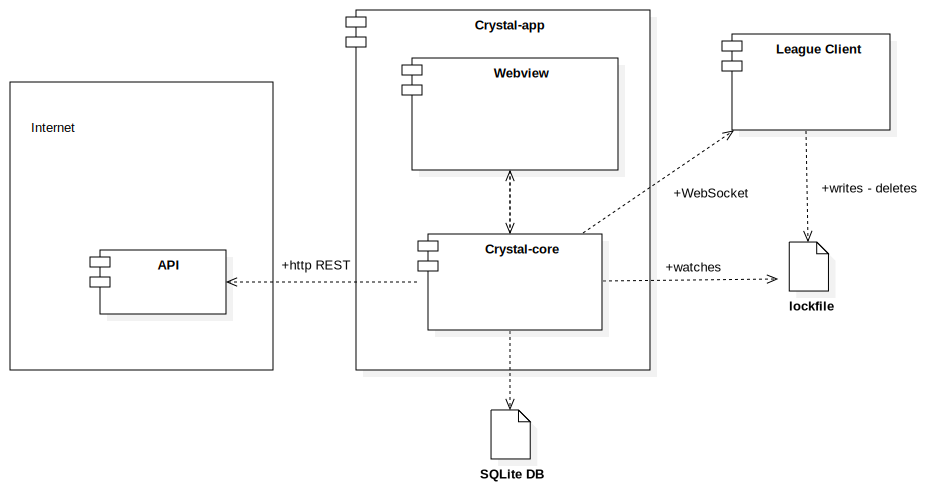

# crystal

Crystal Ball for League of Legends. Get pro builds and runes before you start, and learn from your mistakes.

This is a side project, in very early phases of development. 😊

## Architecture



## Development

To start running binary

```bash
cargo watch -x 'run --bin=crystal-core'
```

To log events you'll need to set up `RUST_LOG` environment variable.

```bash
RUST_LOG=crystal_core=debug cargo watch -x 'run --bin=crystal-core'
```

For windows you can run the following

```powershell
$env:RUST_LOG="crystal_core=debug"

cargo watch -x 'run --bin=crystal-core'
```
